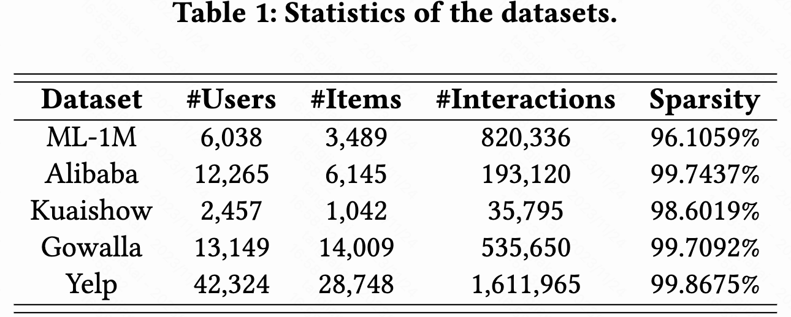
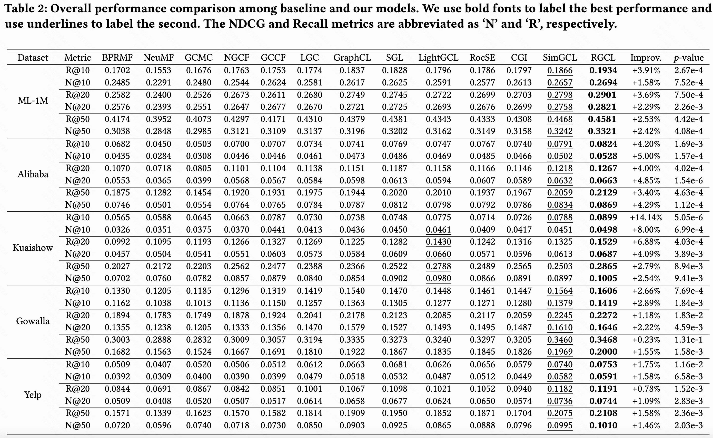

# 1. Abstract

In recent years, graph contrastive learning (GCL) has received increasing attention in recommender systems due to its effectiveness in reducing bias caused by data sparsity.However, most existing GCL models rely on heuristic approaches and usually assume entity independence when constructing contrastive views. We argue that these methods struggle to strike a balance between semantic invariance and view hardness across the dynamic training process, both of which are critical factors in graph contrastive learning. 

To address the above issues, we propose a novel GCL-based recommendation framework RGCL, which effectively maintains the semantic invariance of contrastive pairs and dynamically adapts as the model capability evolves through the training process. Specifically, RGCL first introduces decision boundary-aware adversarial perturbations to constrain the exploration space of contrastive augmented views, avoiding the decrease of task-specific information. Furthermore, to incorporate global user-user and item-item collaboration relationships for guiding on the generation of hard contrastive views, we propose an adversarial-contrastive learning objective to construct a relation-aware view-generator. Besides, considering that unsupervised GCL could potentially narrower margins between data points and the decision boundary, resulting in decreased model robustness, we introduce the adversarial examples based on maximum perturbations to achieve margin maximization. We also provide theoretical analyses on the effectiveness of our designs. Through extensive experiments on five public datasets, we demonstrate the superiority of RGCL compared against twelve baseline models.

# 2. Contributions

- We propose a model-agnostic graph contrastive learning framework, which utilizes dynamic decision boundary-aware adversarial perturbations to constrain the perturbation space of contrastive augmented view, achieving a better balance between semantic preserving and contrastive hardness enhancing.
- We develop a joint learning algorithm based on multi-view contrastive learning and adversarial learning to optimize RGCL, empowering better representation uniformity while improving model robustness via margin maximization.
- We give theoretical analyses to underscore the importance of hard contrastive views in model optimization and elucidate the insights behind the efficacy of RGCL in enhancing robustness.
- Extensive experiments on five real-world datasets demonstrate the superior performance of our proposed RGCL framework.

# 3. Dataset Information

<center>Table 1: Statistics of the datasets used in our experiments.</center>
<div align=center></div>

# 4. DownLoad

[download link](https://drive.google.com/file/d/1jLU1PRUUdoX96jRSH5itm1AX8TWU9-AY/view?usp=drive_link)

# 5. Main Results

<center>Table 2: Overall comparison between the baselines and our models.</center>
<div align=center></div>

# 7. Usage

run program

```
python code/quick_start.py --use_gpu --gpu_id 0 --log --saved --dataset yelp --model RGCL_LGC
```

# 8. Detailed parameter search ranges

We fixed the embedding size and (positive sample) batch size as 64, 4096, respectively. 

| Hyper Parameters | Tuning range                         |
| :--------------: | :----------------------------------- |
|   $\lambda$   | {1e-6,1e-5,1e-4,1e-3}                |
|  learning_rate  | {0.0005,0.001,0.005,0.01,0.05}       |
|     n_layers     | {1,2,3}                              |
|    $\alpha$    | {1e-5,5e-5,1e-4,5e-4,1e-3,5e-3,1e-2} |
|     $\mu$     | 0.1                                  |
|   $\epsilon$   | {0.005,0.01,0.05,0.1,0.5,1.0}        |
|     $\tau$     | {0.05,0.1,0.2,0.5,1.0,5.0,10.0}      |

# 9. Runtime Environment

- System: Linux, 20.04.1-Ubuntu
- CPU: Intel(R) Xeon(R) Gold 5318Y CPU @ 2.10GHz
- CPU-Memory: 512G
- GPU: NVIDIA A40(45G)
- Pytorch: torch-1.9.0+cu111
